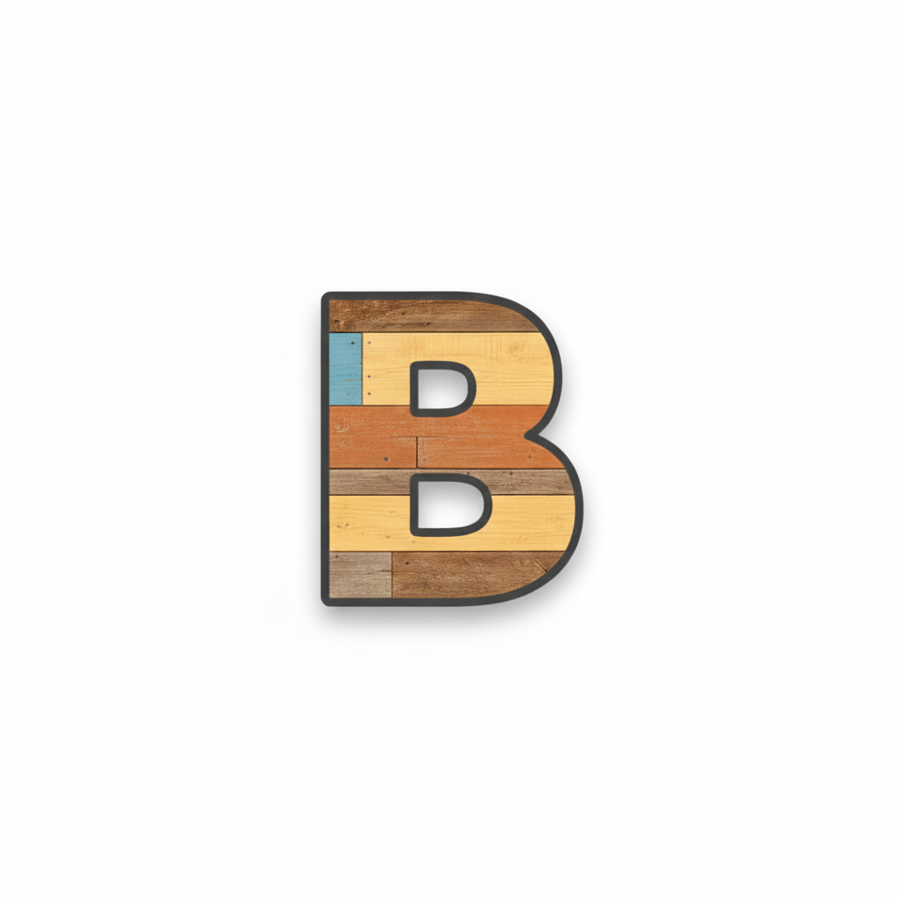
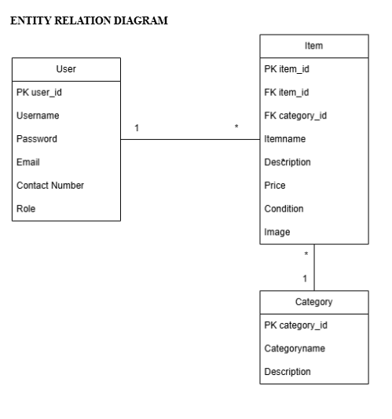
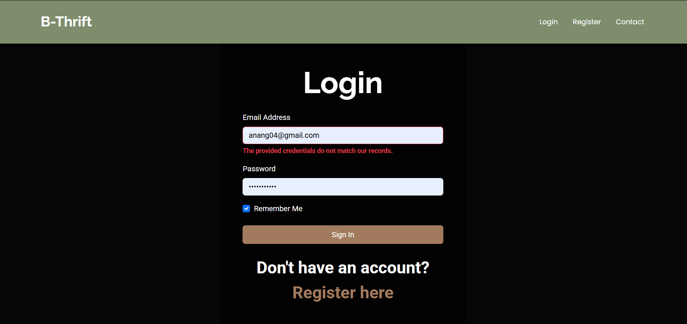
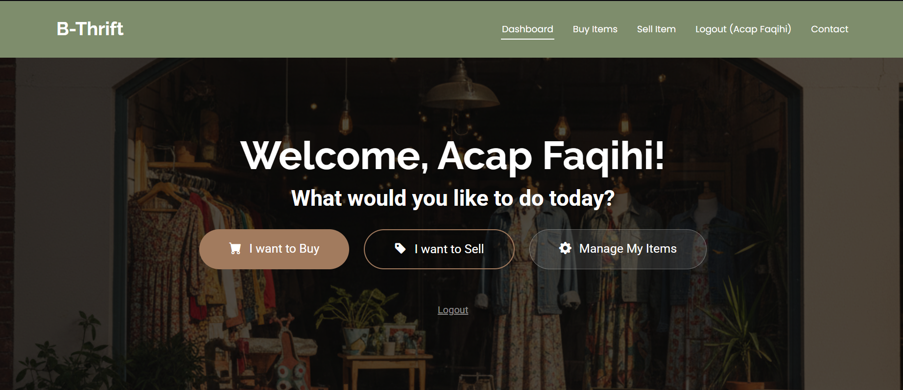
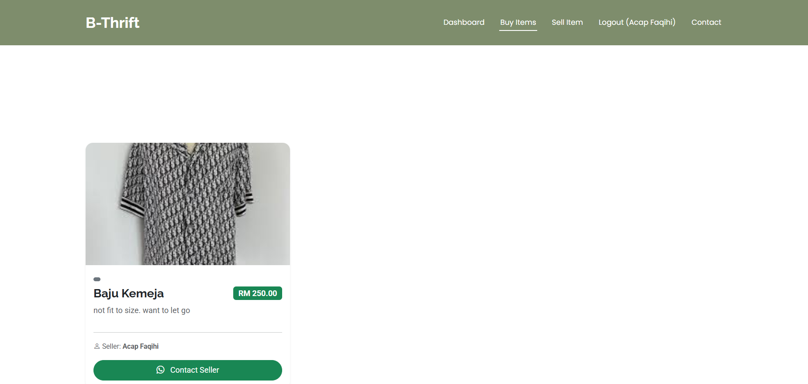
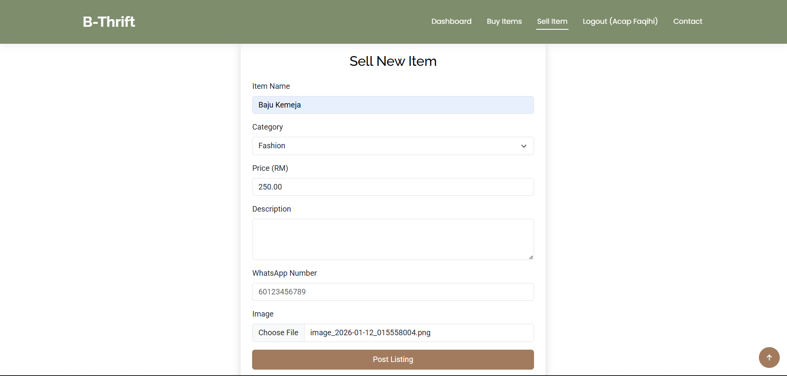

<p align="center">
  
</p>

<p align="center">
<a href="#"></a>
<a href="#"></a>
<a href="#"></a>
</p>

## About B-Thrift

B-Thrift is a web-based thrift store application developed for the students of **International Islamic University Malaysia (IIUM)**, specifically focusing on **Mahallah Bilal** residents. The platform provides a dedicated marketplace where students can buy and sell pre-loved items such as clothing, books, and daily necessities.

Following the philosophy that *"One man's garbage is another man's treasure,"* B-Thrift promotes a circular economy, sustainability, and affordability within the campus community.

## Project Objectives

- **Primary Goal**: Create a functional and secure thrift platform for Mahallah Bilal residents.
- **Sustainability**: Encourage the reuse of items to reduce environmental waste.
- **Community Support**: Help students save money by providing affordable second-hand alternatives.
- **Technical Growth**: Implement a robust Web Application using Laravel's MVC architecture and CRUD operations.

## Features and Functionalities

### 👤 Student Features
- **Secure Authentication**: Registration and Login restricted to the student community.
- **Item Browsing**: View available thrift items with high-quality images and descriptions.
- **Seller Dashboard**: Full CRUD capabilities—users can create, edit, and delete their own listings.
- **Contact Integration**: Direct WhatsApp/Contact links to facilitate easy meet-ups at Mahallah Bilal.

### ⚙️ System Features
- **MVC Architecture**: Clean separation of logic using Models, Views, and Controllers.
- **Image Uploads**: Integration with local storage for product photography.
- **Form Validation**: Secure data entry to prevent errors and invalid listings.

## Group Information (Section 3)

We are a team of four students dedicated to building a better thrifting experience for our Mahallah:

| Name | Matric No | Role |
| :--- | :--- | :--- |
| **ARSHAD SULAIMAN BIN AZLI** | 2313957 | Project Lead / Backend |
| **ANANG PUTERA BIN SELAMAT** | 2310711 | Database / Logic |
| **AMIR AZFAR BIN MUSTAFA KAMAL** | 2315719 | UI/UX Designer |
| **ASHRAF FAQIHI BIN AHMAD FAKHRUDIN** | 2314689 | Documentation / QA |

## Technical Implementation

### Database Design (ERD)
The system is built on a relational database managed via MySQL, ensuring data integrity between users and their listings.

<p align="center">
  
</p>


### Sequence Diagram
This diagram illustrates the interaction between the User, the App, and the Database during the login and item creation process.

<p align="center">
  
</p>


### Core Laravel Components
- **Routes**: Clean, SEO-friendly URLs using `web.php`.
- **Controllers**: Logic handling via `ProductController`, `AuthController`, and `ContactController`.
- **Blade Templates**: Responsive UI built with Bootstrap and Laravel Blade.

## Mockups & Interface
Below are the visual representations of the B-Thrift user interface:

| Login Page | Home Page |
| :---: | :---: |
|  |  |

| Buying Process | Selling Page |
| :---: | :---: |
|  |  |

## Installation and Setup

1. **Clone the project**
   ```bash
   git clone [https://github.com/Cadman733/B4Bilal.git](https://github.com/Cadman733/B4Bilal.git)

2. Install Composer dependencies

   ```bash

    composer install

3. Setup Environment

   ```bash

    cp .env.example .env
    php artisan key:generate

4. Run Migrations

   ```bash

    php artisan migrate


5. Launch Application

   ```bash

    php artisan serve


## Conclusion
B-Thrift successfully demonstrates the implementation of a community-focused marketplace. By leveraging the Laravel framework, we have created a platform that is not only functional but also contributes to the sustainability goals of IIUM.

Key Achievements
Implemented full CRUD operations for item listings.

Developed a secure authentication system for student safety.

Created a responsive UI using the DevFolio template and Bootstrap.

Aligned project goals with Shariah-compliant and sustainable practices.


License
The B-Thrift project is open-sourced software licensed under the MIT license.


***

